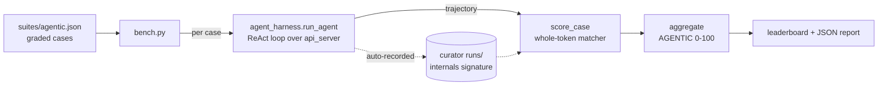

# Agent benchmark — fine-tune & compare on tool use

A full **agentic tool-use benchmark**: run the ReAct harness over a graded task
battery against one or more models, score with a weighted **AGENTIC score**
(0–100), and rank models or gate a fine-tune before/after. The measurement half
of the reasoning program ([roadmap](roadmap.md)); the harness it exercises is
[agent-harness](agent-harness.md).

> [!important] Why the harness (not raw generation)
> Native single-round `tool_calls` tests don't measure the thing that makes
> tiny models usable: the multi-step loop that runs the real tool and feeds the
> observation back, **overriding the model's hallucinated result**. The
> benchmark scores whole trajectories, so it rewards exactly that.

## Pipeline

## Pieces

- **`agent_harness.py`** — the Python ReAct harness (faithful port of
  `web/agent.html`): identical local tools, few-shot prompt, tolerant parser
  (ReAct text **and** native `tool_calls`), degeneration detector, bounded loop.
  Drives any OpenAI-compatible endpoint. `run_agent(base, model, task, tools)`
  → trajectory.
- **`suites/agentic.json`** — 34 graded cases across 11 categories:
  single-tool-arithmetic, unit-conversion, argument-extraction,
  multi-step-chain, tool-selection-distractor, abstain, error-recovery,
  hallucination-correction, grounding, robustness-negative,
  nondeterministic-did-call. Golds are the **exact tool outputs**
  (locked by `test_agent.py`).
- **`bench.py`** — runner + scorer + leaderboard. `--models
  LABEL=BASE#MODEL ...`, `--limit`, `--no-native`, `--internals`, `--min-score`
  (exit-code gate), `--out`. Writes a JSON + markdown report under `reports/`
  (gitignored).
- **`test_agent.py`** — CI gate locking the tool golden values (the JS↔Python
  registry parity contract), the whole-token matcher, and the scoring logic.

## The score

`AGENTIC = 100·(0.45·Capability + 0.25·Precision + 0.20·Discipline +
0.10·Efficiency)`

| bucket | members |
|---|---|
| **Capability** 0.45 | task_success 0.55 · grounding 0.20 · hallucination_override 0.25 |
| **Precision** 0.25 | tool_precision 0.40 · tool_recall 0.35 · abstention 0.25 |
| **Discipline** 0.20 | format_adherence 0.60 · (1−degeneration) 0.40 |
| **Efficiency** 0.10 | step_efficiency 0.70 · throughput 0.30 |

Per case → PASS / PARTIAL / FAIL: PASS needs the answer correct **and** grounded
in a real tool result **and** tool discipline (recall 1.0, precision 1.0). The
matcher is **whole-token numeric with tolerance** + comma/unit canonicalization
— `"100"` does not match `"1000"`, `"993"` does not match `"29931"`, `"8,849"`
matches `8849`.

## Anti-gaming (from the adversarial review)

- Whole-token matcher (no substring wins); distractor tool-sets on most cases so
  "always call the one tool" fails; grounding requires a value the tool returned
  and the prompt did **not** contain; hallucination-correction uses
  precedence/large-product traps, not a model-specific wrong number; abstain
  cases forbid firing an unrelated tool and accept a decline **or** the
  parametric fact; a paired over-refusal case catches fine-tune-induced
  over-refusal; native-`tool_calls` models get real JSON-Schema params (fair
  grading). The harness prompt permits abstention (no "always call a tool"
  contradiction). `test_agent.py` gates tool-registry drift.

## Fine-tune gate (before/after)

Run the same suite on base and fine-tuned endpoints:
`python bench.py suites/agentic.json --models base=…#base ft=…#ft`. Ship the
fine-tune only if AGENTIC improves by ≥3 points with **no per-case task_success
regression**, discipline non-regression (format_adherence, degeneration hold),
and a targeted gain (≥0.10 in one of override / tool_recall / format). Keep a
~20% holdout (override + unanswerable-abstain cases) out of checkpoint
selection. Serving stacks aren't byte-deterministic even at temp 0 — trust the
aggregate, not trajectory hashes; widen thresholds or use N-run majority if
needed.

## Internals tie-in (measure → inspect → iterate)

With `--internals` (server engine), each case pulls its recorded run's
[curator](components.md#curator) signature so a behavioral failure is correlated
with an internals one: format failure ↔ high answer-region entropy;
degeneration ↔ repetition + flat confidence; ungrounded "lucky" answer ↔ early
settle-depth on a value that doesn't co-vary with an Observation. Present only
in richer server runs; browser/mock runs show `n/a`.

## Verified

`agent_harness.py` drives **LFM2.5-1.2B** correctly on the live server:
single-tool (`Action: calculator("47*19+100")` → real `993` → answer 993),
multi-step chains, and **error recovery** (a bad `convert` call → tool error →
the model recovers with the calculator). `test_agent.py` green.
