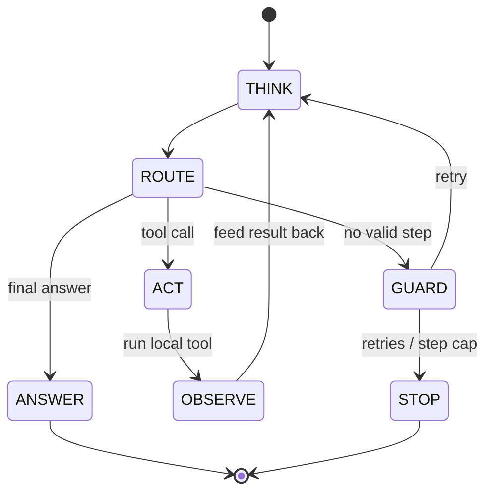

# Agent harness — a state machine for tiny models

The in-browser **micro-agent harness**: a finite state machine that drives a
tiny model through a bounded tool-use loop, entirely client-side. It is both the
controller (it owns the control flow) and a live visualization (you watch the
model move through each state). Sibling docs: [components](components.md) ·
[engines](engines.md) · [flows](flows.md).

> [!important] Why a harness
> Sub-1B models can't reliably use tools on their own. The harness supplies the
> scaffolding — a ReAct prompt, a tolerant parser, a guard/retry, a step cap —
> that turns one forward pass into multi-step behaviour. Per the project tenet
> *"tiny models are the lab"*: the harness is what makes them act like agents,
> and it stays **honest** — when a tiny model flubs the format, the failure is
> shown (GUARD/STOP), never hidden.

## The state machine



| state | who acts | what happens |
|---|---|---|
| TASK | harness | wrap the task with a system prompt teaching the ReAct format + tool list |
| THINK | **model** | generate one step (streamed); the only place the model itself runs |
| ROUTE | harness | parse the text: `Action:` / `Answer:` (earliest wins) / neither |
| ACT | harness | parse args, run the local tool in the page |
| OBSERVE | harness | append `Observation: <result>`, loop back to THINK |
| ANSWER | harness | final answer → DONE, loop stops |
| GUARD | harness | no valid action → nudge with the format + retry, or STOP |

## Tools (local, in-page, no network)

Real tools genuinely compute; **sandbox** tools read a tiny canned table and say
so on the label (honest pixels).

| tool | kind | signature |
|---|---|---|
| calculator | real | `calculator(expression)` — safe arithmetic eval (regex-gated) |
| convert | real | `convert(value, from, to)` — length / mass / temperature |
| clock | real | `clock()` — device date & time |
| random_int | real | `random_int(min, max)` — seeded per run → reproducible |
| weather | sandbox | `weather(city)` — canned table (paris, tokyo, …) |
| lookup | sandbox | `lookup(term)` — canned mini-KB |

## ReAct protocol & parsing

The system prompt teaches, with a concrete example built from the first enabled
tool:

```
Thought: <one short sentence>
Action: calculator(expression="12*8+5")
        ↳ Observation: <result>   (injected by the harness)
Thought: …
Answer:  <final answer>
```

The parser is deliberately tolerant: it finds the first `Action: tool(args)` or
`Answer: …` (whichever comes first), reads args as `key=value` or positional,
and **truncates any model-hallucinated `Observation:`** so only the model's own
Thought/Action/Answer are trusted. A JS mirror of `server.parse_tool_calls`
([components](components.md#server)); no native tool-calling is used
client-side.

## Two surfaces

- **`/agent` (`web/agent.html`)** — the guided education page. Explicit 3-step
  flow (pick a micro model → pick a task + tools → run), the full **state-machine
  graph** + a **trace tape** of transitions, a per-state explainer, per-step
  top-1 confidence, and a **scripted-demo** fallback (a canned trace through the
  same machine — runs with no WebGPU and no download). Engines: **browser**
  (SmolLM2-135M/360M, Qwen2.5-0.5B on WebGPU via transformers.js) **and** a
  **server** card — the hooked Python model (`api_server`, e.g. LFM2.5-1.2B),
  driven via SSE. The tiny browser models mostly fail (honest); the server model
  is tool-trained and drives the loop to a **successful** answer on the same
  graph — the intended before/after. Verified live: 135M/0.5B → STOP;
  LFM2.5-1.2B → `Action: calculator(...)` → real Observation `993` → correct
  Answer (it even overrode the model's hallucinated `1033`).
- **chat.html agent mode** — a header toggle + compact state-pill strip that
  wraps the chat's generation in the same loop, so the run happens **with the
  full internals viz** filling per step (each step is a run segment in the
  heatmap). Works with browser engines and the server engine (same ReAct text
  protocol for both, so internals stream either way).

> [!note] ReAct-for-both, by design
> chat agent mode uses the ReAct **text** protocol for the server engine too
> (not native `tool_calls`). Native spec-compliant `tool_calls` remain available
> to external SDK clients via the API ([api-server](components.md#api-server));
> the harness is about driving *tiny* models that lack that training.

## Decoding & robustness (empirically tuned)

Verified in-browser against SmolLM2-135M/360M and Qwen2.5-0.5B (q4f16 on WebGPU),
and against the transformers.js 3.4.2 source:

- **`repetition_penalty: 1.15`, greedy** (`do_sample:false`). Greedy decoding
  makes these tiny models collapse into loops ("I have used the conversion…" ×N);
  a mild penalty curbs it. `1.3` + `no_repeat_ngram_size:3` was tested and
  **degenerates into token soup** — avoided. NB `temperature`/`top_p` are
  **no-ops** in transformers.js 3.4.2 (no warper is wired), so sampling isn't a
  usable lever here; `stop_strings` is also unsupported (steps are truncated
  post-hoc at `Observation:`). `max_new_tokens: 150` per step.
- **Concrete few-shot prompt.** Tiny models **parrot `<placeholder>` tokens
  literally** (they echoed "<one short sentence>"), so the format is taught with
  a full worked example (`FEWSHOT` / `A_FEWSHOT`), plus an explicit
  "don't compute/recall yourself — always call a tool" instruction.
- **Retry cap = 2.** A GUARD failure nudges with a placeholder-free example and
  retries at most twice (reset on any successful Action), then STOPs — instead
  of burning the whole step cap on identical greedy output. The malformed text
  is **not** echoed back into context (it amplifies the loop); only a cleaned
  Thought is kept.
- **Degeneration detector** (`looksDegenerate`/`aDegen`) labels a repetition
  collapse honestly ("a classic tiny-model failure") rather than a generic miss.

> [!warning] Honest limits — these micro models mostly fail
> 135M–500M q4f16 models are at the **edge of agentic ability**: they usually
> ramble or ignore the tool format, and no prompt/decoding tweak reliably fixes
> that (bigger models like 1.5B OOM in-browser; q8 exports degrade to garbage).
> The UI says so up front and frames the struggle as the lesson.

## Honest fallback

WebGPU missing, or a tiny model that never produces a valid step → the failure
is surfaced (GUARD → retry → STOP), and `/agent` offers a scripted demo (through
the same graph) so the lesson still works. Nothing is faked to force success.
