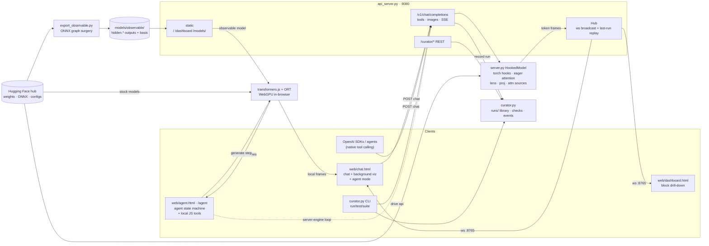
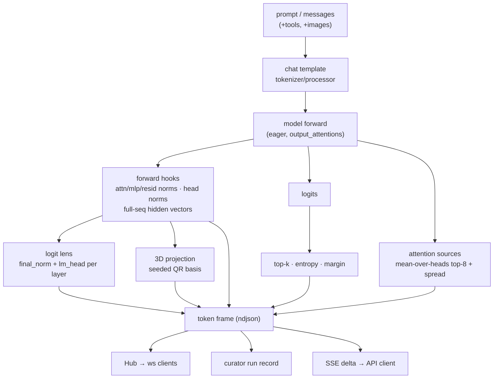

# Architecture

Component detail: [components](components.md) · wire format:
[protocol](protocol.md) · request sequences: [flows](flows.md)

## Component graph

> [!note] The agent harness is client-side
> `web/agent.html` and the chat's agent mode run a ReAct tool-use **state
> machine** in the browser — local JS tools, no server round-trip (except the
> optional server-engine loop, dashed above). It reuses the same transformers.js
> loader and `onProto` viz funnel — see [agent-harness](agent-harness.md).

## Data flow (one server-engine token)

> [!note] Three details the graphs can't show
> - The prefill step additionally emits a `context` message: every prompt
>   position's per-layer projection (the blue trace in embed view).
> - The Hub keeps `[topology, context, token*, done]` of the current run and
>   replays it to late-joining ws clients — the deep-link handoff in
>   [flows](flows.md) depends on this.
> - Observable browser runs produce the same frame shape client-side
>   (resid_norm + proj + topk only) via a patched `model.forward` reading
>   `hidden.*` outputs — see [engines](engines.md).
