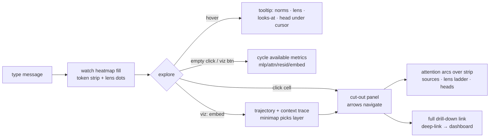
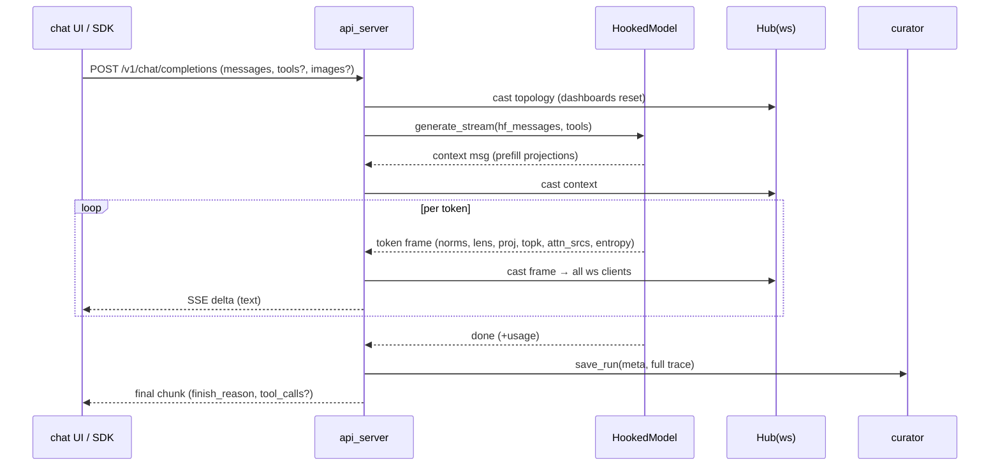
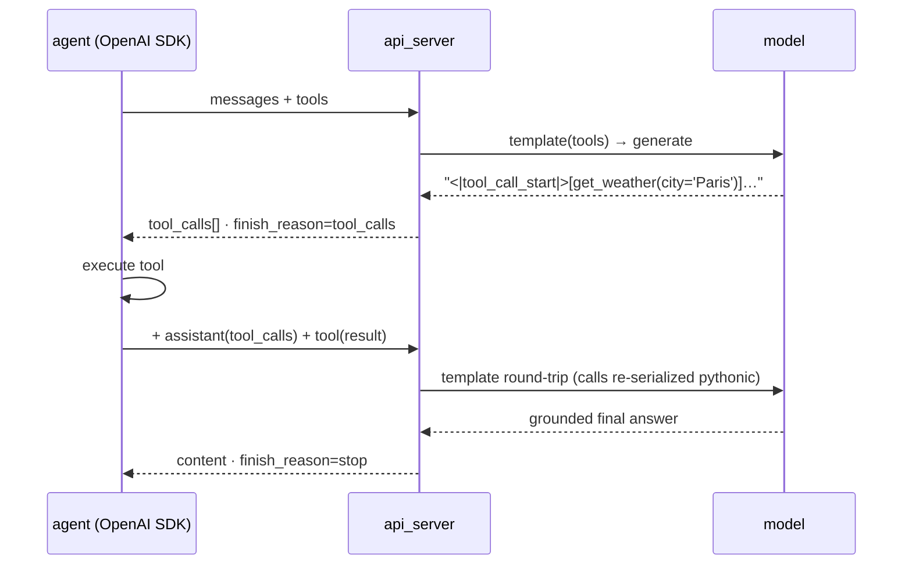
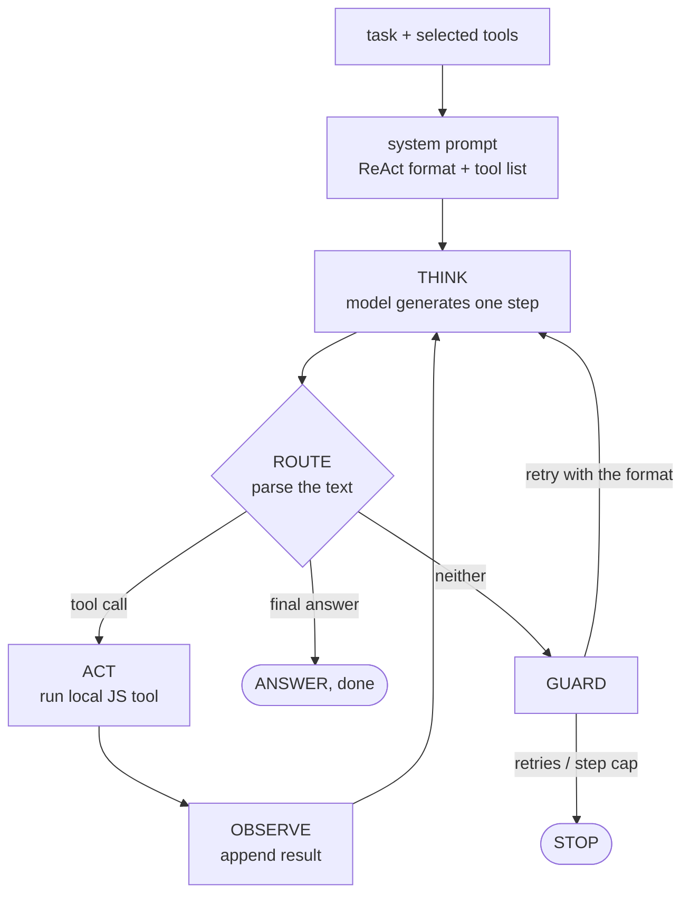
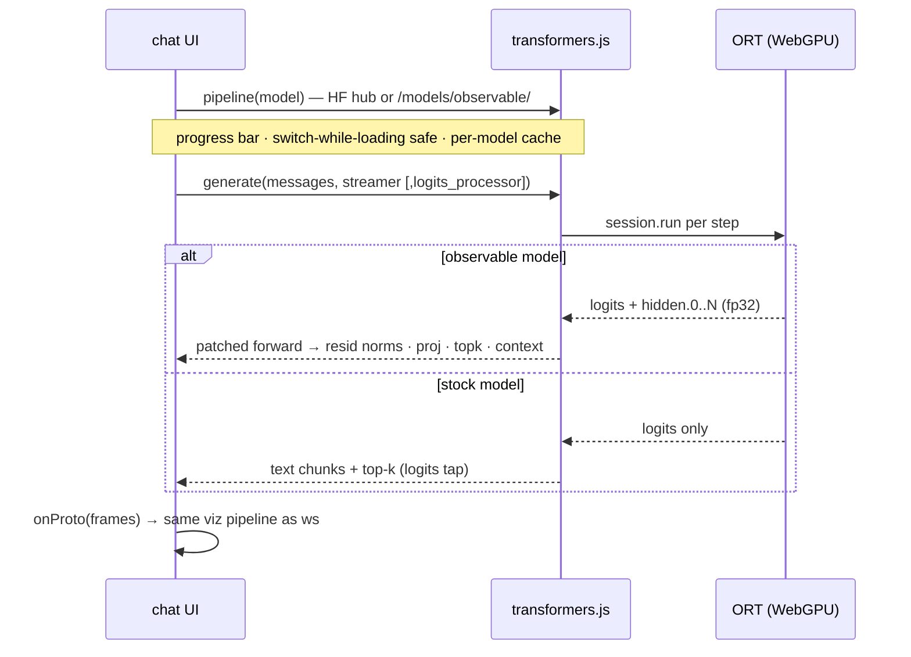
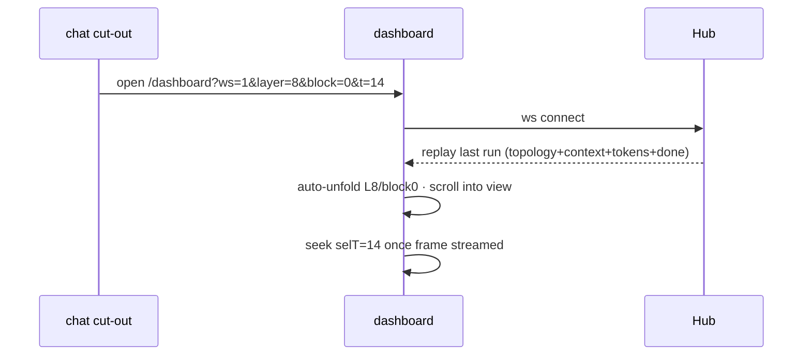
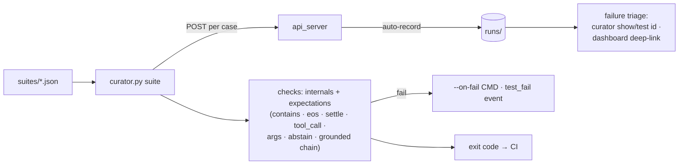

# Flows

Who's who in these diagrams: [components](components.md) · message shapes:
[protocol](protocol.md) · per-engine capability: [engines](engines.md)

## User flow — inspecting a generation (server engine)

## Chat request — server engine

## Tool-calling agent loop

## In-browser agent harness (ReAct state machine)

Drives a tiny browser model through a bounded tool-use loop, client-side —
`/agent` (guided + graph) and the chat's agent-mode toggle. Full states, tools
and parsing: [agent-harness](agent-harness.md).

## Browser engines

## Deep-link handoff (cut-out → dashboard)

## Curator suite (CI gate)

